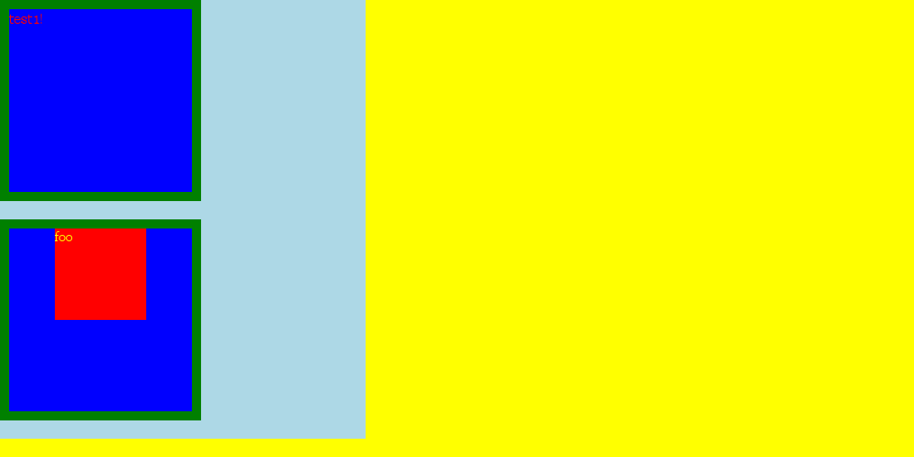

# tiny-rendering-engine

从零开始实现一个玩具版浏览器渲染引擎



## 功能

* [x] HTML 解析器 - v1 分支
* [x] CSS 解析器 - v2 分支
* [x] 构建样式树 - v3 分支
* [x] 布局树 - v4 分支
* [x] 绘制 - v5 分支

## 技术原理文档

正在编写...

## 疑难问题

### 安装 canvas 报错

请参考 canvas 安装指引文档：<https://github.com/Automattic/node-canvas/wiki>

## 开发
安装依赖
```sh
pnpm i
```
开发
```
pnpm dev
```
构建
```
pnpm build
```
测试
```
pnpm test
```

## 示例
所有示例均在 examples 目录下，查看示例前需要先执行构建命令 `pnpm build`。

## 参考资料
* [Let's build a browser engine!](https://limpet.net/mbrubeck/2014/08/08/toy-layout-engine-1.html)
* [robinson](https://github.com/mbrubeck/robinson)
* [渲染页面：浏览器的工作原理](https://developer.mozilla.org/zh-CN/docs/Web/Performance/How_browsers_work)
* [关键渲染路径](https://developer.mozilla.org/zh-CN/docs/Web/Performance/Critical_rendering_path)
* [计算机系统要素](https://book.douban.com/subject/1998341/)
